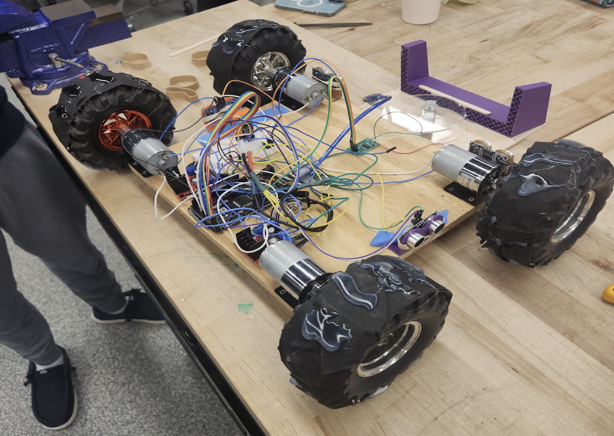
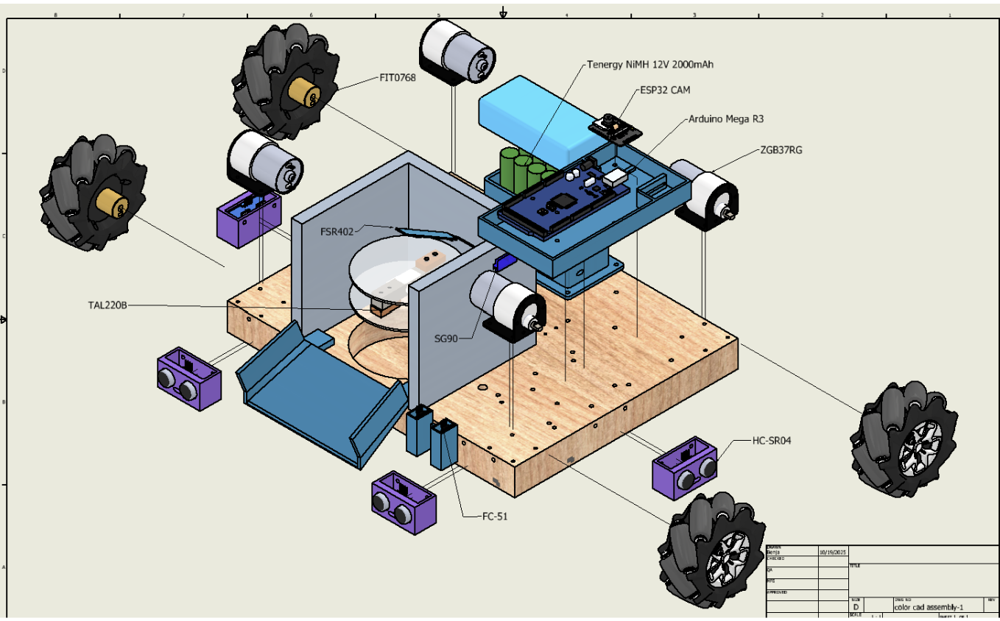
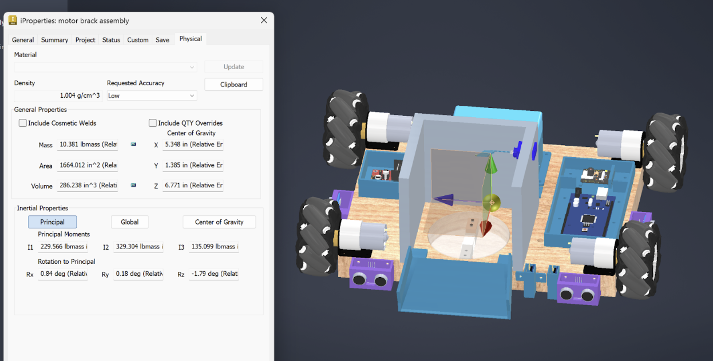
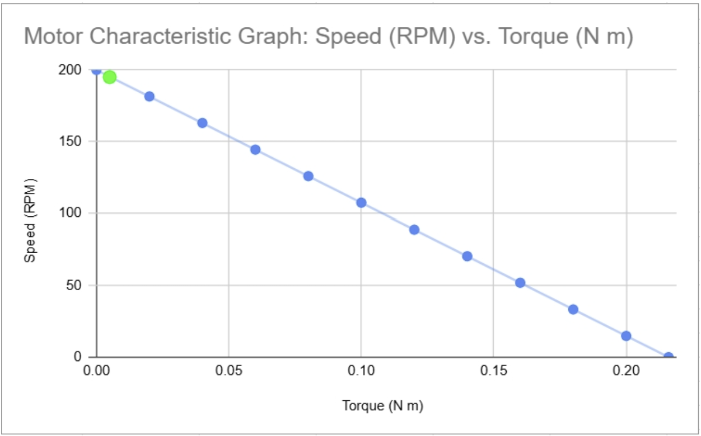
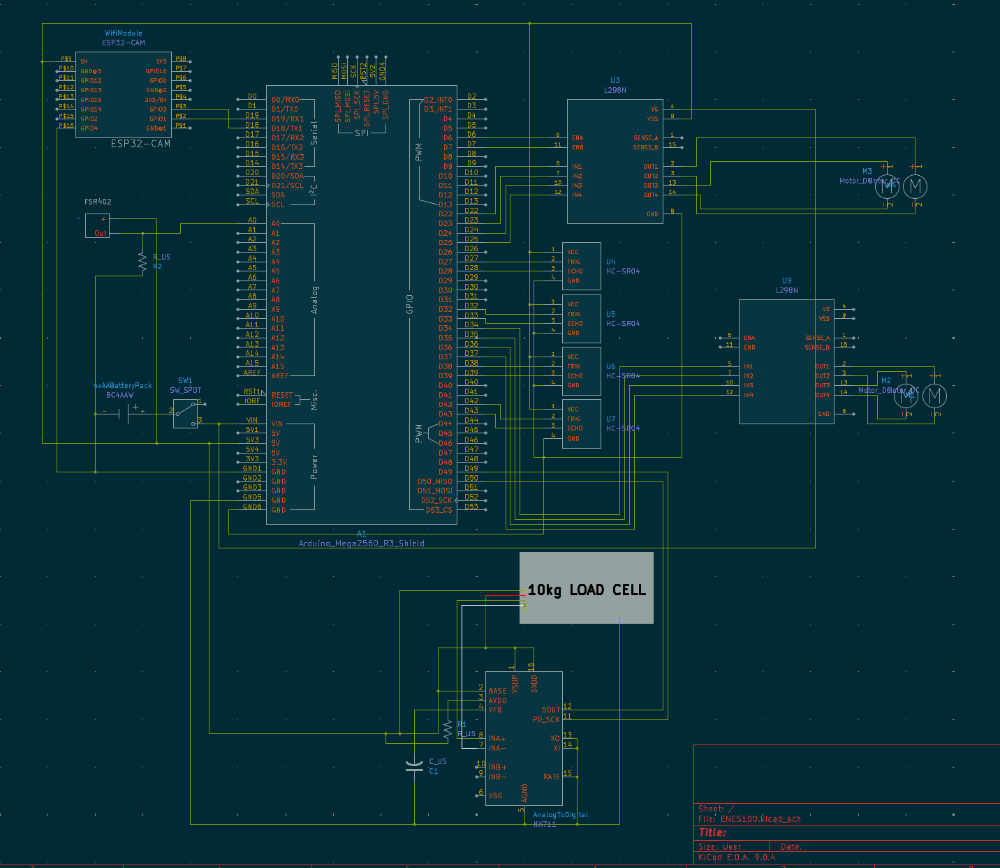

# Material Mission – Autonomous OTV (Object Transport Vehicle)

Autonomous Object Transport Vehicle (OTV) designed for navigation, obstacle avoidance, object pickup, weighing, and material identification as part of a team-based engineering design project.

---

## Project Overview

The Material Mermaids OTV is a four-wheel autonomous robotic platform capable of completing a structured mission course. The vehicle autonomously navigates to target locations, avoids obstacles, collects a ball using a ramp and scoop mechanism, weighs the object using an onboard load cell, and classifies the object based on material properties.

The project emphasizes full system engineering, including mechanical design, propulsion modeling, embedded electronics, power budgeting, and technical documentation.

---

## Mechanical Design

- Plywood chassis with corner-mounted DC motors  
- Direct-drive wheel configuration  
- Front ramp and scoop mechanism to guide object onto scale  
- Load cell positioned between ramp and base for accurate weighing  

### Mass Properties & Center of Mass

Mass properties and center-of-mass (COM) were evaluated using Autodesk Inventor iProperties to ensure stability during motion and object intake. The COM analysis informed component placement to reduce tipping and uneven wheel loading.

---

## Propulsion & Drive System

- **Drive configuration:** Four-wheel differential drive  
- **Motors:** 12V DC geared motors (200 RPM nominal)  
- **Steering:** Independent left/right motor speed control via PWM  
- **Wheel radius:** 0.0762 m  

Analytical propulsion modeling was performed to estimate rolling resistance, required torque, and achievable linear speed. Experimental testing revealed lower real-world speeds due to wheel slip and uneven load distribution, which were addressed through traction modification.

---

## Electronics & Power System

### Core Electronics
- Arduino Mega (main controller)
- 2× L298N H-bridge motor drivers
- 4× HC-SR04 ultrasonic sensors
- HX711 amplifier with load cell
- Force-sensitive resistor (FSR)
- WiFi communication module
- 12V NiMH battery pack

### Power Budget
- **Total current draw:** ~2.14 A  
- **Battery capacity:** 2000 mAh @ 12 V  
- **Estimated runtime:** ~56 minutes  

Motor speed was PWM-limited to reduce current draw and minimize wheel slip.

---

## Mission Capabilities

The OTV successfully:
- Navigates autonomously to within 150 mm of target locations
- Avoids and passes multiple obstacles
- Collects and weighs an object using an onboard scale
- Classifies object material (foam vs rigid plastic)
- Completes the mission course without human intervention

---

## Documentation

- Sustainability / Eco Audit: `docs/Sustainability_Eco_Audit_Report.pdf`
- Full Engineering Report: `docs/Report.pdf`

---

## Team

**Material Mermaids**  
Ava Mantzouranis  
Benjamin Fichter  
Nicholas Scozzafava  
Maren Iski  
Charlotte Grohowski  
Ethan Monders  
Alfonso Gruss  
Michael Baugh  

---

## Skills Demonstrated

- Mechanical system design and CAD modeling  
- Propulsion modeling and experimental validation  
- Embedded systems and motor control  
- Sensor integration and data acquisition  
- Power budgeting and sustainability analysis  
- Engineering documentation and technical communication  
